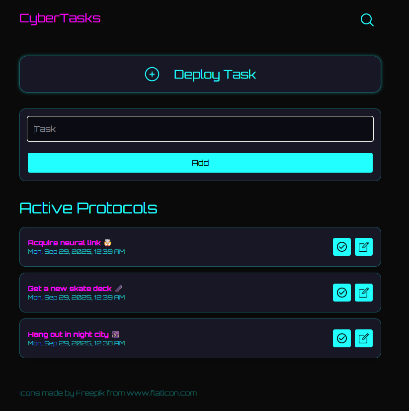

# 🚀 CyberTasks

A lightweight, modern to-do web app built with Express and Supabase. CyberTasks is designed as a minimal, fast single-page experience to create and manage tasks with a cyber / neon aesthetic. This repository contains the server (Express) and a small static front-end in `public/` that communicates with Supabase for persistence.

---

## 📸 Screenshots


---

## ✨ Features
- View a list of tasks (sorted by newest first)
- Add new tasks (via the add-task form)
- Static single-page front end with Tailwind CSS for rapid styling
- Supabase used as the backend database (postgREST-like API via the Supabase client)

## 📝 Planned (coming soon): 
1. Edit and complete task actions

2. User sign up / sign in, and per-user task lists.

---

## 🛠 Tech Stack
**Front End:** HTML, vanilla JavaScript, Tailwind CSS

**Back End:** Node.js, Express

**Database:** Supabase (Postgres managed by Supabase)

**Other:** dotenv for config, nodemon for development

---

## 📂 Project Structure
Root of repository (relevant files and folders):

```
package.json
server.js                # Express server entry (ESM)
.env                     # Local environment variables (ignored by git)
config/                  # Application configuration (table names etc.)
controllers/             # Request handlers
db/                      # Database client wrapper (Supabase)
models/                  # (empty / future models)
public/                  # Front-end static files (served by Express)
  ├─ index.html
  ├─ js/
  ├─ assets/
  └─ output.css
routes/                  # Express routers
README.md
```

---

## ⚙️ Installation & Setup
1. Clone the repo

   git clone <repo-url>

2. Change into the project directory

   cd CyberTasks

3. Install dependencies

   npm install

4. Create a `.env` file at the project root and add these values (example already provided in `.env.example` or below):

```
PORT=3867
SUPABASE_URL=https://your-project.supabase.co
SUPABASE_KEY=your-service-or-anon-key
SUPABASE_TABLE=tasks
```

Use a Supabase project and table named `tasks` (or change `SUPABASE_TABLE` appropriately). The server uses `dotenv` to load environment variables.

5. Start the app

Development (auto-reload):

```bash
npm run dev
```

Production / simple run:

```bash
npm start
```

6. Tailwind CSS (build or watch)

Build once:

```bash
npm run build:css
```

Watch for changes during front-end development:

```bash
npm run tailwind
```

Open http://localhost:3867 (or the PORT you set) in your browser.

---

## 📊 Usage Examples
- Fetch all tasks (server route): GET /tasks
- Add a task (server route): POST /tasks with JSON body { "taskName": "My new task" }

Example JavaScript (client-side fetch)

```js
// Fetch tasks
const res = await fetch('/tasks');
const data = await res.json();

// Add a task
await fetch('/tasks', {
  method: 'POST',
  headers: { 'Content-Type': 'application/json' },
  body: JSON.stringify({ taskName: 'Buy milk' })
});
```

---

## 🧠 Lessons Learned
- Keeping configuration centralized (`config/config.js`) makes it easy to change table names or other constants.
- Serving a small, static front-end from the same Express app keeps the project simple for quick demos.
- Using Supabase's JS client simplifies CRUD patterns without writing custom SQL endpoints.

---

## 🚀 Future Improvements
- [ ] Edit and Complete tasks (UI + API)
- [ ] Per-user task lists (require authentication)
- [ ] User registration and sign in (Supabase Auth or custom auth)
- [ ] Input validation + better error handling on the server
- [ ] Add automated tests and CI workflow

---

## 📜 License
This project is released under the MIT License. See `LICENSE` for details (add one if you want to publish).

---

## Notes
- The repository currently uses ES Modules. Node 18+ is recommended and `type: "module"` is set in `package.json`.
- The `.env` file is included locally for development in this workspace; do not commit secrets to version control.
